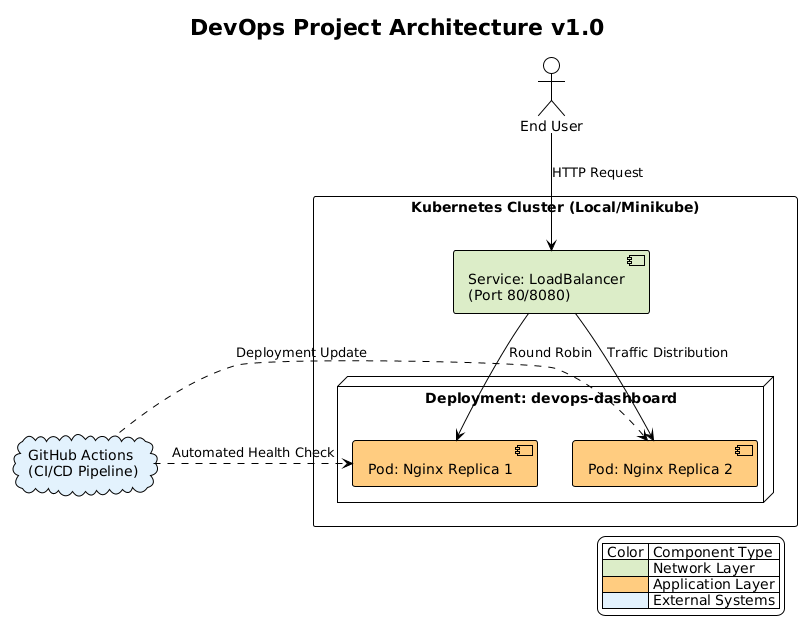

# DevOps Status Dashboard


A lightweight, containerized web application designed to demonstrate a complete DevOps infrastructure lifecycle. This project implements modern CI/CD practices, container orchestration, and automated health checks.

## Architecture

The system architecture follows cloud-native best practices:


_(Generated from PlantUML source code in `docs/architecture.puml`)_

The system is built as a static HTML application served by **Nginx**, running on **Alpine Linux** for minimal footprint.

- **Infrastructure:** Docker & Docker Compose
- **Orchestration:** Kubernetes (Deployment & Service)
- **CI/CD:** GitHub Actions (Build -> Test -> Healthcheck)
- **Version Control:** Git (Conventional Commits)

## Getting Started

### Prerequisites

- Docker & Docker Compose installed
- (Optional) Minikube or K8s cluster

### Running Locally (Docker Compose)

To start the application with full orchestration:

```bash
docker-compose up -d --build
```
